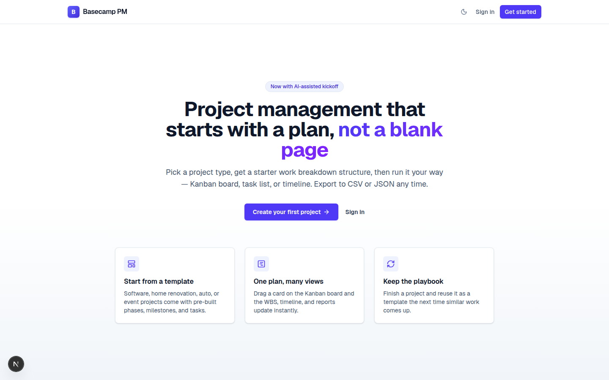
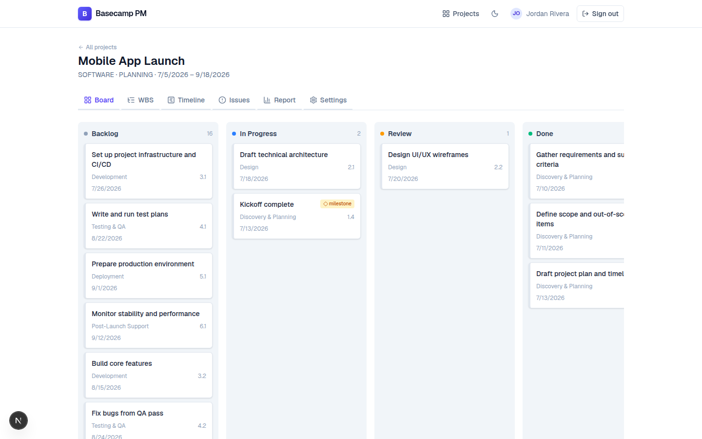
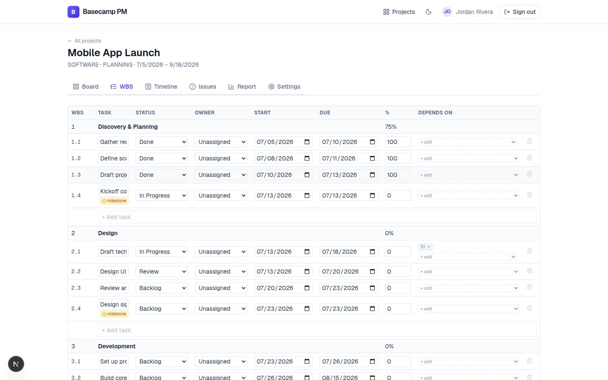
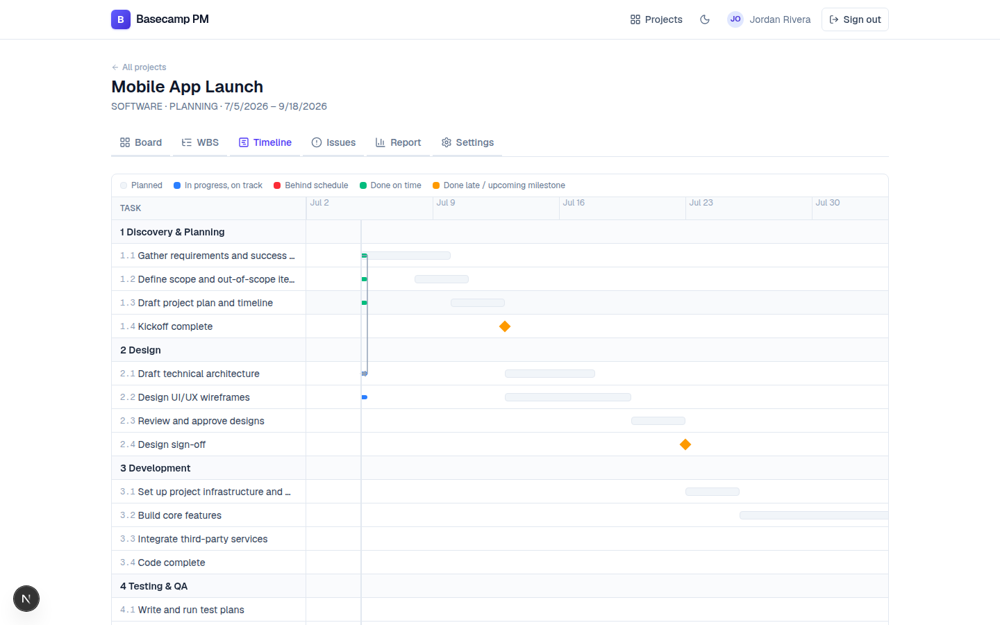
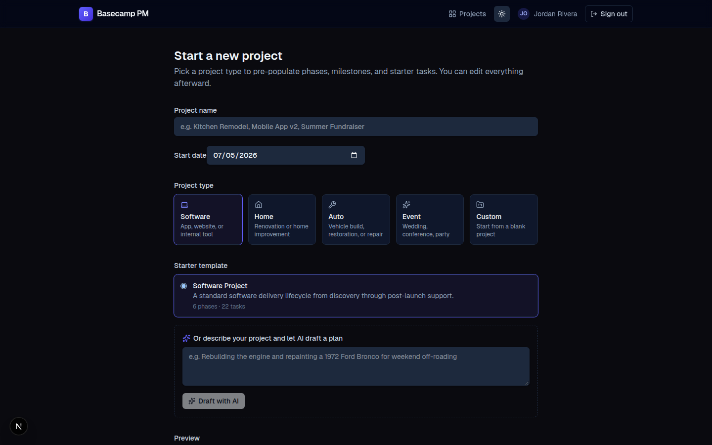

# Basecamp PM

A project management app that starts with a plan, not a blank page. Pick a
project type and get a pre-populated work breakdown structure, then run the
work your way — Kanban board, WBS/list view, or Gantt timeline — all backed by
the same data, so a change in one view shows up everywhere else.



## Screenshots

| Kanban board | WBS / list view |
|---|---|
|  |  |

| Timeline with dependency arrows | Project wizard (dark mode) |
|---|---|
|  |  |

## Features

**Planning**
- **Project-type wizard** — Software, Home, Auto, Event, or Custom, each with
  a starter set of phases, milestones, and tasks
- **AI-assisted kickoff** — describe the project in a sentence and let Claude
  draft (or refine) the phase/task tree
- **Work breakdown structure (WBS)** — hierarchical, inline-editable task
  list with phases, owners, dates, and percent complete

**Execution**
- **Kanban board** — drag and drop between Backlog / In Progress / Review /
  Done; status changes are reflected instantly in every other view
- **Gantt timeline** — planned vs. actual bars per task, colored by whether
  work is on track, behind schedule, or done late; a red connector line
  flags a real scheduling conflict when a dependency isn't respected
- **Task dependencies** — mark a task as depending on another; the app
  rejects circular dependencies and flags blocked tasks on the board and WBS
- **Issue log** and a **reporting dashboard** (on-track vs. behind schedule,
  grouped by owner)

**Collaboration & data**
- **Multi-user projects** with roles (Owner / Editor / Viewer) — owners can
  invite by email with a chosen role, change a member's role, or remove them
- **Delete a project** — an owner-only, confirm-by-typing-the-name action
  that cascades to its phases, tasks, and issues
- **In-app notifications** — a bell in the nav with an unread count for
  activity on shared projects (members added/removed, role changes, task
  status changes, issues logged/resolved)
- **Share project data externally** — mint a per-project API token and pull
  the project's data (`GET /api/external/projects/:id`) from another
  instance of this app or any external tool, or push tasks to a SharePoint
  list via Microsoft Graph
- **CSV / JSON export & import** — take the plan offline and bring changes
  back, matched by WBS code so edits merge instead of duplicating
- **Complete → reuse as template** — turn a finished project into a starter
  template for the next similar one, capturing lessons learned
- **Light / dark theme**, persisted per browser

## Tech stack

Next.js 16 (App Router) · React 19 · TypeScript · Tailwind CSS 4 · Prisma 7 +
PostgreSQL · NextAuth (Auth.js) v5 · dnd-kit · lucide-react · Anthropic Claude
API · Vitest

## Running with Docker (recommended)

Requires [Docker](https://docs.docker.com/get-docker/) and the Compose plugin.

1. Copy the example environment file and fill in the required values:

   ```bash
   cp .env.example .env
   ```

   At minimum, set `AUTH_SECRET` (generate one with `openssl rand -base64 32`).
   `ANTHROPIC_API_KEY` is optional — without it, everything works except the
   "Draft with AI" step in the project wizard.

2. Build and start the app and its Postgres database:

   ```bash
   docker compose up --build
   ```

   On first start, the app container automatically runs database migrations
   and seeds the four built-in starter templates before the server starts.

3. Open <http://localhost:3000>, sign up, and create your first project.

To stop everything: `docker compose down` (add `-v` to also delete the
database volume and start fresh next time).

### Configuration

All configuration is via environment variables, set in `.env` (see
`.env.example` for the full list):

| Variable | Required | Purpose |
|---|---|---|
| `POSTGRES_USER` / `POSTGRES_PASSWORD` / `POSTGRES_DB` | No (defaults provided) | Credentials for the Postgres container |
| `AUTH_SECRET` | **Yes** | Session encryption key for NextAuth |
| `ANTHROPIC_API_KEY` | No | Enables the AI-assisted project kickoff |
| `APP_PORT` | No (defaults to 3000) | Host port the app is exposed on |

If you put the app behind a reverse proxy on a different host/port than
`localhost:3000`, no extra configuration is needed — `docker-compose.yml`
already sets `AUTH_TRUST_HOST=true`, which is required for NextAuth to accept
requests in a self-hosted (non-Vercel) production deployment.

## Running locally without Docker

Requires Node.js 22+ and a running PostgreSQL instance.

```bash
npm install
cp .env.example .env   # set DATABASE_URL, AUTH_SECRET, etc.
npx prisma migrate deploy
npx prisma db seed
npm run dev
```

The app is then available at <http://localhost:3000>.

## Standalone single-file version

[`standalone/index.html`](./standalone/index.html) is a self-contained,
offline-friendly alternative — no server, no database, no build step. Open the
file directly in a browser and it works, storing everything in that browser's
`localStorage`. It's a companion for quick local use, not a replacement for
the full app above.

It covers most of the same ground: project templates (Software/Home/Auto/
Event/Custom), Kanban board with drag-and-drop, WBS with dependencies, Gantt
timeline with critical-path highlighting, issue log with aging buckets, and
the full report suite (KPI drill-down, burnup chart, critical path, cycle
time, CSV export). It intentionally leaves out things that need a real
backend: multi-user accounts and roles, file attachments, and the AI-assisted
kickoff.

## Scripts

| Command | Description |
|---|---|
| `npm run dev` | Start the dev server |
| `npm run build` | Production build |
| `npm start` | Start the production build |
| `npm run lint` | Run ESLint |
| `npm test` | Run the automated test suite (Vitest) |
| `npm run db:migrate` | Apply Prisma migrations (`prisma migrate deploy`) |
| `npm run db:seed` | Seed the built-in starter templates |

## Roadmap

**Shipped**
- [x] Project-type wizard with starter templates + AI-assisted kickoff
- [x] Kanban board, WBS, and Gantt timeline views over shared task data
- [x] Task dependencies with cycle detection and blocked-task indicators
- [x] Issue log and reporting dashboard
- [x] CSV / JSON export and import
- [x] Multi-user projects with roles
- [x] Complete → reuse as template
- [x] Dark mode
- [x] Automated test suite (Vitest) and Docker deployment
- [x] Installable PWA — manifest, service worker with an offline fallback
      page, and a swipeable Kanban board on phone-sized screens
- [x] Team management — role-based invites (Owner/Editor/Viewer), remove
      members, change roles
- [x] Delete a project (with a confirmation step)
- [x] In-app notifications for project activity (members, roles, task
      status, issues) with a bell/unread count in the nav
- [x] API tokens for sharing project data with another instance, plus a
      SharePoint list sync integration via Microsoft Graph

**Planned**
- [ ] **Proper team invites** — invite by email without requiring the
      invitee to already have an account (pending invite → accept → join)
- [ ] **Production hardening** — rate limiting on auth endpoints, structured
      logging, broader test coverage on the route handlers
- [ ] **Mobile-first WBS and Gantt views** — the table and timeline still
      rely on horizontal scrolling on narrow screens; a card-style layout
      for phones is the next mobile increment (see below)

### Mobile app

Direction: **PWA**, built on top of the existing Next.js app rather than a
separate codebase. Shipped so far:

- A web app manifest and generated icons, so the app is installable to a
  phone's home screen with its own icon and standalone window (no browser
  chrome)
- A service worker that precaches an offline fallback page and caches
  static assets, so a lost connection shows a friendly "you're offline"
  screen instead of a browser error
- A swipeable, snap-scrolling Kanban board layout at phone widths

Still open: the WBS table and Gantt timeline are usable on mobile via
horizontal scroll but aren't card-based yet — that's the next piece of
mobile work. React Native/Expo and Capacitor were considered but ruled
out for now since a PWA reuses the existing backend and UI with no
separate codebase to maintain.

## License

MIT — see [LICENSE](./LICENSE).
